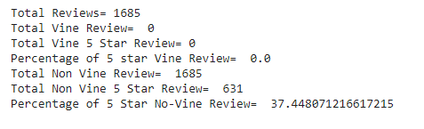

# Amazon_Vine_Analysis

## Overview of Analysis
In this analysis, I've been taksed to analyze Amazon reviews written by members of the paid Amazon Vine Program. In this project, the Digital Video Games dataset will be analyzed from the Amazon Review Dataset. PySpark was used to perform the ETL process to extract the dataset, transform the data, connect to an AWS RDS instance, and load the transformed data into pgAdmin. Next, PySpark was used to determine if there is any bias toward favorable reviews from Vine members in the dataset.

## Results
The following dataset for Digital Video Games were used in this analysis: https://s3.amazonaws.com/amazon-reviews-pds/tsv/amazon_reviews_us_Digital_Video_Games_v1_00.tsv.gz

Using PySpark, the results are shown below:

- How many Vine Reviews and non-Vine reviews were there?
  - There are a total of 0 Vine reviews and 1685 Non-Vine reviews

- How many Vine reviews were 5 stars? How many non-Vine reviews were 5 stars?
  -There are 0 Vine reviews with 5 stars and 631 Non-Vine reviews with 5 stars.
  
- What percentage of Vine reviews were 5 stars? What percentage of non-Vine reviews were 5 stars?
  -There are 0 percentage of Vine reviews with 5 stars and 37.4% of non-Vine reviews with 5 stars.

## Summary
